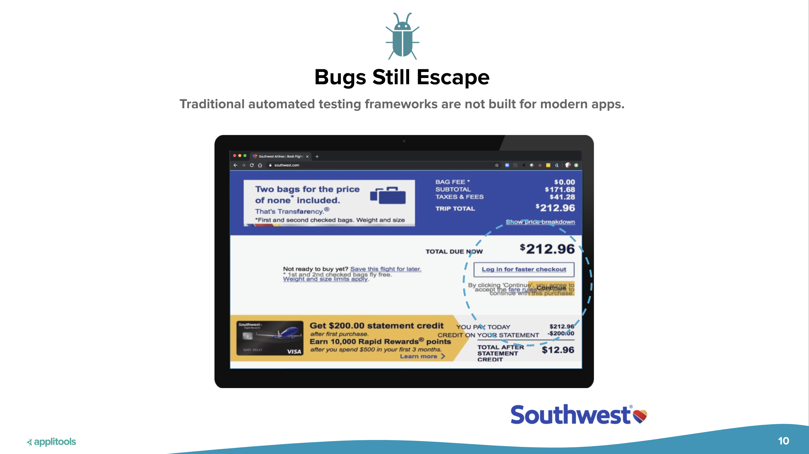
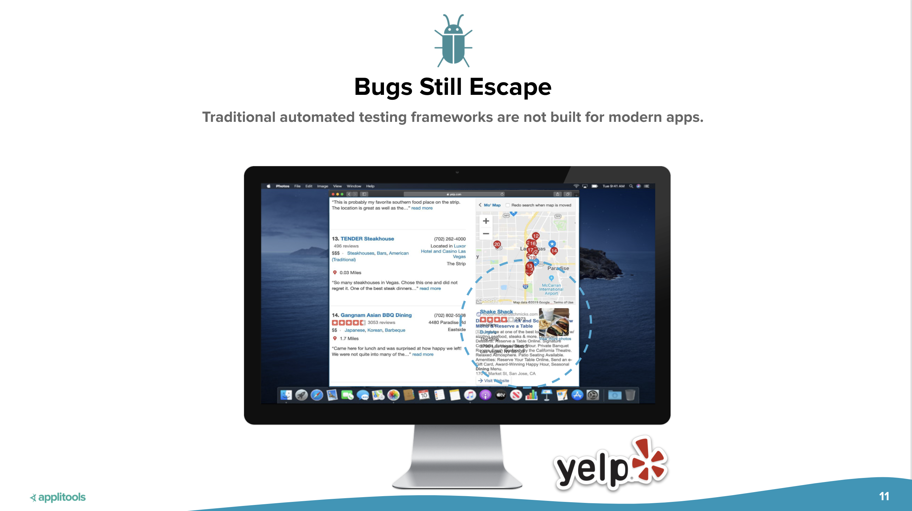
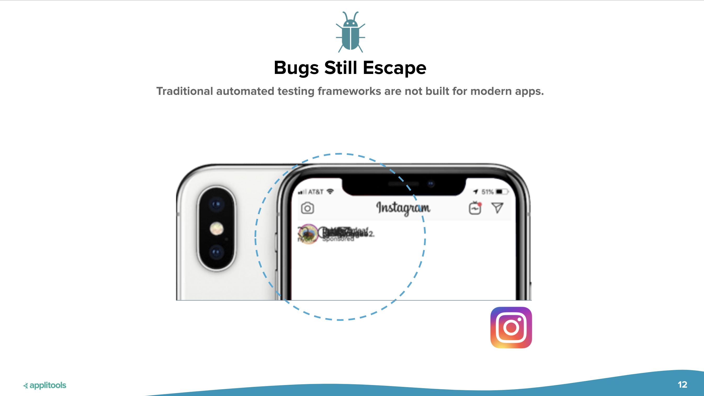
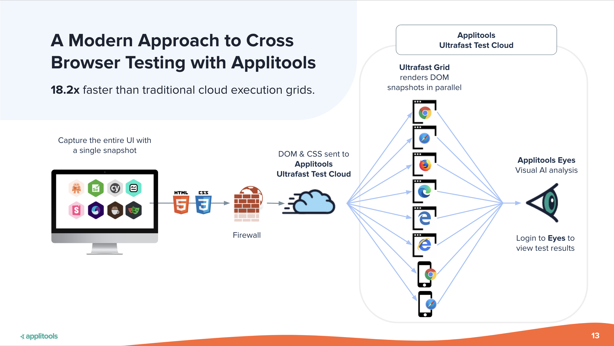
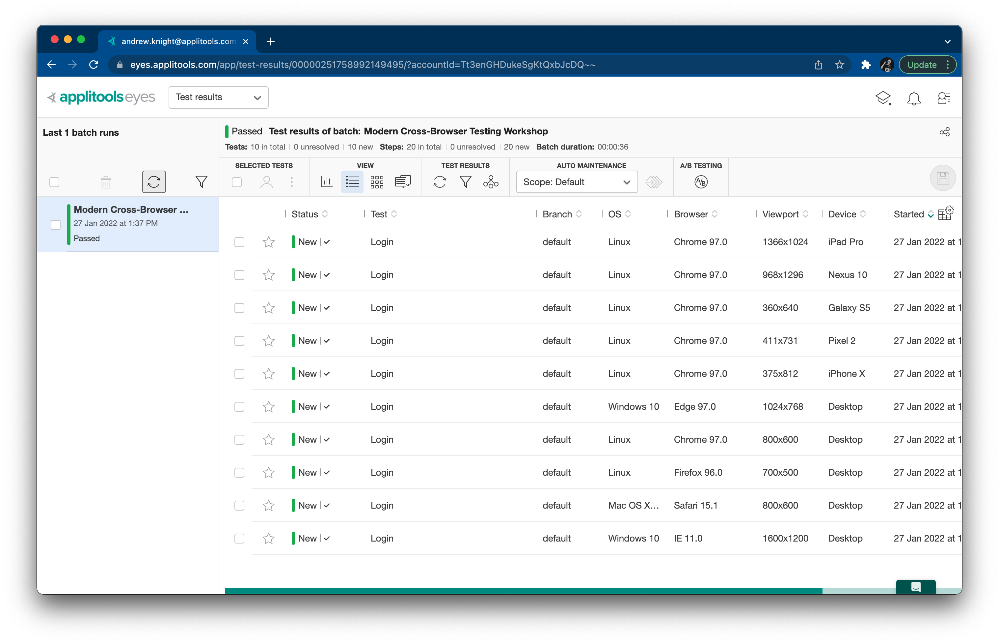
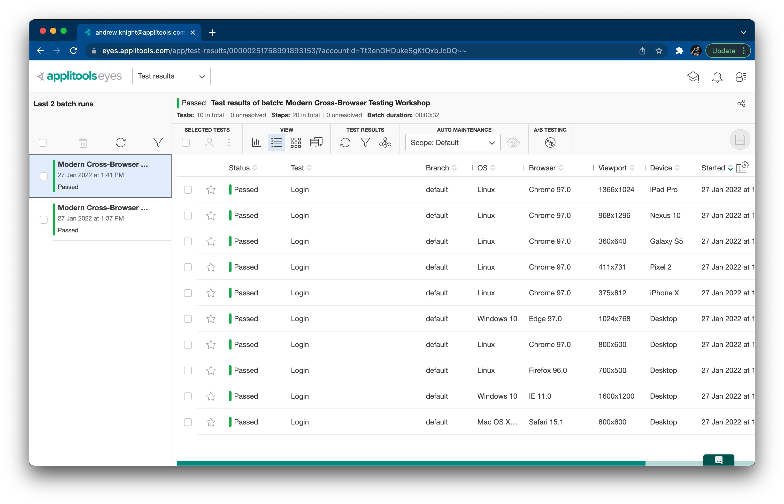
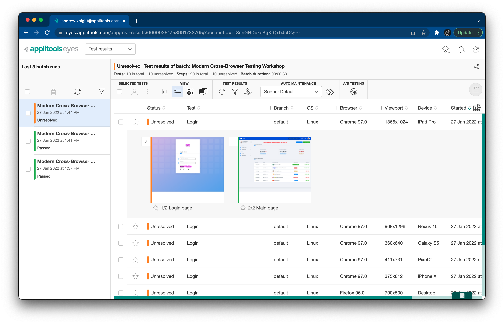
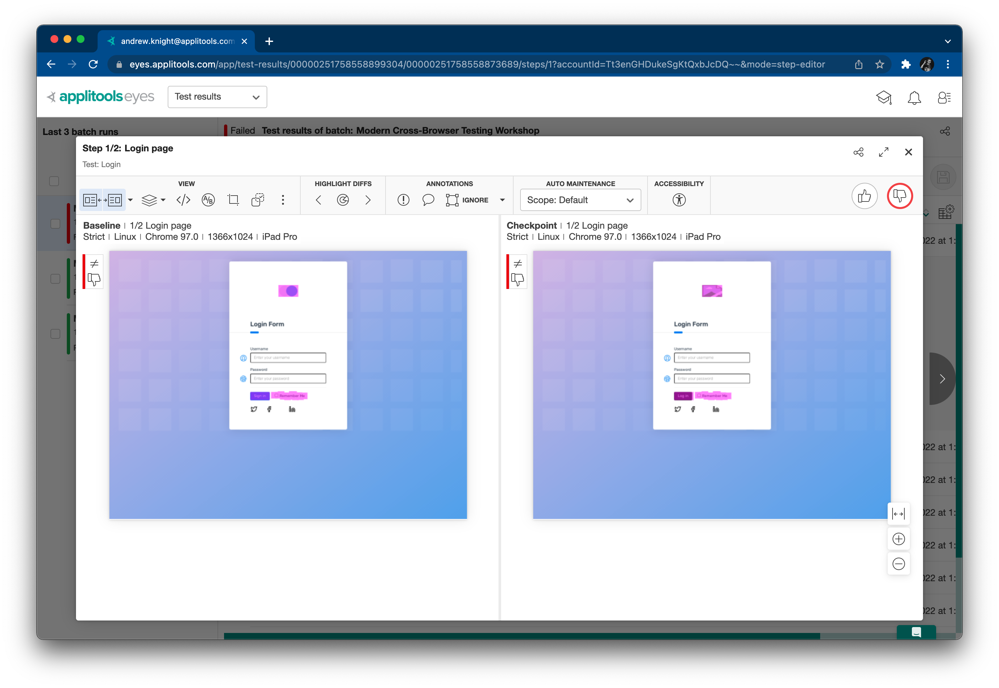

# Workshop Walkthrough

This guide provides a full written walkthrough for the
[Modern Cross-Browser Testing with Cypress](http://applitools.info/qjg) workshop
led by [Pandy Knight](https://twitter.com/AutomationPanda)
and hosted by [Applitools](https://applitools.com/).
You can code along with the video recordings,
or you can reference it afterwards to help you learn more.


## 1. Traditional cross-browser testing

Traditional cross-browser testing requires lots of work,
both in automating test cases and in maintaining testing infrastructure.
Let's give this a try ourselves to see what it takes.


### 1.1. Writing a typical login test

Web UI testing is all about app behaviors:
interacting with visual interfaces and verifying outcomes.
Let's automate a simple website login test to use for cross-browser testing.
We will use the [Applitools demo site](https://demo.applitools.com):
`https://demo.applitools.com`.
This site has a twist, though:
it has a [second version](https://demo.applitools.com/index_v2.html)
with visual differences at `https://demo.applitools.com/index_v2.html`.

The test steps are straightforward:

```gherkin
Scenario: Successful login
  Given the login page is displayed
  When the user enters their username and password
  And the user clicks the login button
  Then the main page is displayed
```

The login page looks like this:


And the main page looks like this:


We can automate this test in many ways,
but for this workshop,
we will build a [Cypress](https://www.cypress.io/) project written in JavaScript.
This repository is structured like a typical Cypress project.
[`cypress/integration/traditional.spec.js`](cypress/integration/traditional.spec.js)
is an automated implementation of this login test:

```javascript
describe('A traditional test', () => {

    beforeEach(() => {
        cy.viewport(1600, 1200)
    })

    it('should log into the demo app', () => {
        loadLoginPage()
        verifyLoginPage()
        performLogin()
        verifyMainPage()
    })
})
```

Cypress uses [Mocha](https://mochajs.org/) as its core test framework.
In Mocha, tests are grouped together in `describe` calls.
The `beforeEach` call sets the browser viewport for Cypress for each test in the group.
Each test is defined using an `it` call.
Here, there is one group ("A traditional test") containing one test ("should log into the demo app").
Each step in the login test is implemented as a helper method.

Loading the login page looks like this:

```javascript
function loadLoginPage() {
    let site = Cypress.env('DEMO_SITE') ?? 'original'
    let extra = (site == 'original') ? '' : '/index_v2.html'
    cy.visit('https://demo.applitools.com' + extra)
}
```

The `loadLoginPage` function uses a Cypress environment variable named `DEMO_SITE`
to specify if the test should run against the original site or the changed site.

Once the login page is loaded, the test verifies that certain things appear:

```javascript
function verifyLoginPage() {
    cy.get('div.logo-w').should('be.visible')
    cy.get('#username').should('be.visible')
    cy.get('#password').should('be.visible')
    cy.get('#log-in').should('be.visible')
    cy.get('input.form-check-input').should('be.visible')
}
```

These assertions explicitly wait for a specific set of elements to appear.
They check purely for appearance – not for any shape, size, or look.

Performing login requires a few WebDriver interactions:

```javascript
function performLogin() {
    cy.get('#username').type('andy')
    cy.get('#password').type('i<3pandas')
    cy.get('#log-in').click()
}
```

Once login is complete, the main page appears.
Unfortunately, there's almost too much on the main page to check!
The test picks a few important things and makes several assertions:

```javascript
function verifyMainPage() {

    // Check various page elements
    cy.get('div.logo-w').should('be.visible')
    cy.get('div.element-search.autosuggest-search-activator > input').should('be.visible')
    cy.get('div.avatar-w img').should('be.visible')
    cy.get('ul.main-menu').should('be.visible')
    cy.contains('Add Account').should('be.visible')
    cy.contains('Make Payment').should('be.visible')
    cy.contains('View Statement').should('be.visible')
    cy.contains('Request Increase').should('be.visible')
    cy.contains('Pay Now').should('be.visible')

    // Check time message
    cy.get('#time').invoke('text').should('match', /Your nearest branch closes in:( \d+[hms])+/)

    // Check menu element names
    cy.get('ul.main-menu li span').should(items => {
        expect(items[0]).to.contain.text('Card types')
        expect(items[1]).to.contain.text('Credit cards')
        expect(items[2]).to.contain.text('Debit cards')
        expect(items[3]).to.contain.text('Lending')
        expect(items[4]).to.contain.text('Loans')
        expect(items[5]).to.contain.text('Mortgages')
    })

    // Check transaction statuses
    const statuses = ['Complete', 'Pending', 'Declined']
    cy.get('span.status-pill + span').each(($span, index) => {
        expect(statuses).to.include($span.text())
    })
}
```

Wow, that's a little overwhelming.
Some assertions just check that elements appear.
Others check aspects of elements, like text values.
Nevertheless, the element locators and the code for performing these assertions are a bit complex.
They also do *not* cover everything on the page.
There's risk that unchecked things could break.


### 1.2. Running the test locally

Let's run this test locally.
To manually launch tests, execute `npx cypress open` from the command line
and then run the target tests from the Cypress browser window that opens.
This repository also has npm scripts for testing declared in `package.json`.
You can run `npm run cypress` to open the Cypress window
or `npm test` to run tests purely from the command line.
The test should take no more than a minute to complete, and it should pass.

Unfortunately, this test overlooks visual things.
Take a look at the "changed" version of the demo site:


Can you spot the subtle differences?

* The icon at the top is broken
* The "Sign in" button now says "Log in"
* This button changed from blue to black

Traditional test automation struggles to detect differences like these.
We could try to add more assertions to our test,
but they'd probably be complicated and fragile.
For now, let's take a risk and ignore them.
(We will revisit ways to handle them better later in this workshop.)

If we want to run this test against either version of the login page,
we could update the `loadLoginPage` method like this:

Try rerunning the test with the changed demo site.
You can execute `npm run cypress:original` and `npm run cypress:changed`
to specify the site version via the `DEMO_SITE` variable.
Even when `DEMO_SITE=changed`, the test will still pass.


### 1.3. Running the test against multiple browsers

Cypress can run tests against Chrome, Edge, and Firefox.
(Unfortunately, other browsers are not supported – at least not yet.)
You can specify the target browser in two ways.

If you run test from the Cypress browser window,
you can select the target browser from the top-right dropdown.
It will show all supported browsers available for testing on your machine:


You can also dictate the target browser with the `--browser <name>` argument.
For example, `npx cypress run --browser chrome` will run tests using Chrome.
`package.json` provides convenient npm scripts for selecting browsers.
For example, `npm run test:chrome` will also run tests against Chrome.

Try running the login test in Chrome, Firefox, and Edge.
It should pass in all browsers.

Note that the target browser is *not* coded into the test case itself.
Tests should be able to run against any browser,
and each test launch should pick one target browser.
If you want to run on multiple browsers,
then trigger the tests separately for each browser.


### 1.4. Scaling out cross-browser testing yourself

Local testing is fine while developing automated tests,
but it's not good practice for running tests "for real."
Local machines have limits:


* Cypres does not support *all* browser types.
  Namely, it does not support Safari or Internet Explorer.
* One machine can have only one version of a browser at a time,
  unless you make some questionable hacks.
* One machine can run only a limited number of tests in parallel.
  Optimal execution time is typically 1 web test per processor/core.
* Laptops are not mobile devices.
  Either you emulate mobile devices or connect remotely to physical devices.
  Cypress also has limitations on its mobile testing capabilities.

Ideally, web UI tests should be run from a Continuous Integration system
with scaled-out infrastructure to handle cross-browser testing.

One way to do this is to build the infrastructure yourself.
Cypress provides guides on 
[parallelization](https://docs.cypress.io/guides/guides/parallelization)
and [cross-browser testing](https://docs.cypress.io/guides/guides/cross-browser-testing).
Essentially, you will need to create a Cypress dashboard and set up a cluster of machines to handle testing.
It's similar to [Selenium Grid](https://www.selenium.dev/documentation/grid/) for Selenium WebDriver.


I used Selenium Grid when I worked at [Q2](https://www.q2.com/).
You can read all about it in a case study I wrote in collaboration with [Tricentis](https://www.tricentis.com/):
[How Q2 uses BDD with SpecFlow for testing PrecisionLender](https://automationpanda.com/2021/09/21/how-q2-uses-bdd-with-specflow-for-testing-precisionlender/).
Basically, we created multiple Selenium Grid instances using Windows virtual machines in Microsoft Azure.
When tests launched, TeamCity (our CI system) ran PowerShell scripts to power on the VMs.
The grid would take a few minutes to boot.
Then, once tests completed, TeamCity ran PowerShell scripts to power off the VMs to save money.
Since we tightly controlled the grids, tests ran just as fast as they did on our local laptops.
We could scale up to 100 parallel tests.


Unfortunately, do-it-yourself infrastructure, whether with Cypress or Selenium, is a hassle.
It's like maintaining an old car: there are always problems.
Figuring out correct setup, security policies, and performance tuning took our team *months*.
It truly was never a finished project because we kept needing to make adjustments as our suites grew.
We also had to set up and configure everything manually.
Any time a browser update came along, we needed to log into every VM and make updates.

On top of perpetual maintenance, our grids would arbitrarily crash from time to time.
Hubs would go unresponsive.
Browser sessions on nodes would freeze.
Debugging these issues was practically impossible, too.
Usually, all we could do was just relaunch test suites.


True cross-browser testing has a combinatorial explosion of screens to cover.
Think about every browser, OS, platform, and version.
Then, think about every page, viewport, and even language.
That's enormous!
Building your own grid, you can accommodate some of these, but not all.


### 1.5. Scaling out cross-browser testing as a service

Instead of building your own infrastructure,
you can pay an external vendor to provide it for you as a cloud-based service.
A vendor handles all the screen combinations for you.
Your test simply needs to declare what you want for your remote Cypress session.
Vendor platforms also typically have nice features like dashboards, screenshots, and videos.


Unfortunately, traditional cross-browser-testing-as-a-service still has problems.
Difficulties with security, debuggability, and reliability are the same as for DIY grids.
Tests also run much slower because they need to communicate with a more distant session.
Anecdotally, my tests have taken 2-4x more time to complete versus running locally or in my own grid.
That's *huge*.
Furthermore, cross-browser vendor services can be quite expensive,
and they set ceilings on your level of scale with your service plans.


## 2. Modern cross-browser testing

There's got to be a better way to do cross-browser testing!
Let's rethink our approach in what we want to test
and how techniques like visual testing can simplify things.


### 2.1. Reconsidering what should be tested

What is the purpose of testing apps across multiple browsers?
Historically, browsers were radically different.
The JavaScript on one page would literally function differently in different browsers.
These days, however, browsers have largely standardized on JavaScript.
Traditional functional testing in one browser is typically good enough to verify that.
Cross-browser testing should focus on the visuals of rendering and responsiveness.

Here are some examples of visual blunders that traditional automated testing would miss:








### 2.2. Introducing Applitools Ultrafast Grid

This is where Applitools can help
with a modern solution for cross-browser testing:
[Visual AI](https://applitools.com/applitools-ai-and-deep-learning/)
with the [Ultrafast Grid](https://applitools.com/product-ultrafast-test-cloud/).



Visual testing is all about capturing snapshots of pages and inspecting them for differences.
Notice how I used the word "snapshot," not "screenshot."
Screenshots are just static pixel images.
A *snapshot* is an instantaneous capture of the whole UI for a page: HTML, CSS, JavaScript, the works!
Snapshots can be re-rendered in different browsers and screen size to test their responsiveness.

Here's how we can rework our old login test into a visual test.
First, we can add the [Applitools Eyes](https://applitools.com/products-eyes/) SDK
to take visual snapshots of the login and main pages.
We still need the Selenium WebDriver automation for interactions,
but we can replace many (if not all) of the old assertions with visual checkpoints.
Next, we can configure a runner to render those snapshots
using multiple browsers and devices in Applitools Ultrafast Grid.
The test will run once locally,
but all cross-browser testing will be done in the Applitools Cloud with parallel execution.

Since the only testing done in Ultrafast Grid is visual rendering and comparison, it's very fast.
The infrastructure is also simpler because communication is a single direction
from the test machine to the Applitools cloud.
There's no back-and-forth communication like with a traditional functional test.

You can use Applitools Eyes and the Ultrafast Grid with any automation tool or framework:
Cypress, Selenium, Appium, Playwright, WebDriverIO, Nightwatch, and more.

If you want specific data on how much faster and more efficient your testing can be
with Visual AI and Applitools Ultrafast Grid,
then check out this report:
[Modern Cross Browser Testing Through Visual AI Report: 3,112 hours of empirical data sourced from 203 engineers](https://applitools.com/modern-cross-browser-testing-report/).


### 2.3. Rewriting login as a visual test

Let's rewrite our login test into a visual test.
The test steps can remain the same, but the setup and assertions will change.
In this repository,
[`cypress/integration/visual.spec.js`](cypress/integration/visual.spec.js)
contains the updated code.

First, we need to install and set up the Applitools Eyes SDK for Cypress:

```bash
$ npm install @applitools/eyes-cypress
$ npx eyes-setup
```

The first command will install the npm package for the project.
The second command will add Applitools Eyes SDK plugins and support to the project.

The login test's steps will remain the same,
but we need to make Applitools Eyes watch the browser.
We do that by starting each test with `cy.eyesOpen(...)`
and ending each test with `cy.eyesClose()`.
When opening Eyes, we also specify the names of the app and the test:

```javascript
describe('A visual test with Applitools', () => {

    it('should log into the demo app', () => {

        cy.eyesOpen({
            appName: 'Applitools Demo App',
            testName: 'Login',
        })

        loadLoginPage()
        verifyLoginPage()
        performLogin()
        verifyMainPage()
    })

    afterEach(() => {
        cy.eyesClose()
    })
})
```

The `loadLoginPage` and `performLogin` methods do not need any changes because the interactions are the same.
However, the "verify" methods can reduce drastically:

```javascript
function verifyLoginPage() {
    cy.eyesCheckWindow({
        tag: "Login page",
        target: 'window',
        fully: true
    });
}

function verifyMainPage() {
    cy.eyesCheckWindow({
        tag: "Main page",
        target: 'window',
        fully: true,
        matchLevel: 'Layout'
    });
}
```

**"A picture is worth a thousand assertions."**
Previously, these methods had multiple complicated assertions
that merely checked if some elements appeared or had certain text values.
Now, Applitools Eyes captures a full snapshot,
checking *everything* on the page like a pair of human eyes.
It's one, simple, declarative capture.
We just say "check it" instead of spending time splicing selectors and making explicit comparisons.
It also covers aspects like broken images and colors that our traditional functional test missed.

As a software engineer myself,
I cannot understate how much development time these visual checkpoints save me.
I spend so much time trying to find locators and program clever assertions,
but they are so fragile,
and there are only so many assertions I can include.

These are the only changes we need to make to the test case
to convert it from a traditional functional test to a visual one.
Not bad!


### 2.4. Running visual tests across multiple browsers

To run tests, we must set our Applitools API key as a system environment variable.
You can fetch your key under your account in the Applitools dashboard.

On macOS and Linux:

```
$ export APPLITOOLS_API_KEY=<value>
```

On Windows:

```
> set APPLITOOLS_API_KEY=<value>
```

Now, we could run our new login test locally on Chrome, Edge, and Firefox,
but if we want to run it in the Applitools Ultrafast Grid,
we need to add one more thing to our project.
Create a file named `applitools.config.js` at the project's root level
with the following contents:

```javascript
module.exports = {
    testConcurrency: 5,
    apiKey: 'APPLITOOLS_API_KEY',
    browser: [
        // Desktop
        {width: 800, height: 600, name: 'chrome'},
        {width: 700, height: 500, name: 'firefox'},
        {width: 1600, height: 1200, name: 'ie11'},
        {width: 1024, height: 768, name: 'edgechromium'},
        {width: 800, height: 600, name: 'safari'},
        // Mobile
        {deviceName: 'iPhone X', screenOrientation: 'portrait'},
        {deviceName: 'Pixel 2', screenOrientation: 'portrait'},
        {deviceName: 'Galaxy S5', screenOrientation: 'portrait'},
        {deviceName: 'Nexus 10', screenOrientation: 'portrait'},
        {deviceName: 'iPad Pro', screenOrientation: 'landscape'},
    ],
    batchName: 'Modern Cross-Browser Testing Workshop'
}
```

`applitools.config.js` configures how to visually test snapshots.
This configuration will test 5 desktop browsers of varying viewport sizes
and 5 mobile devices of varying orientations.
You can test all the major browsers up to two previous versions,
and you can test over 60 emulated mobile devices.
The configuration is concise and declarative.
Notice how even though Cypress cannot test Safari, IE, or mobile browser locally,
the Ultrafast Grid *can* test snapshots from Cypress tests using those browsers!

`testConcurrency` controls the degree of parallel execution in the Ultrafast Grid.
(If you have a free account, you may be limited to 1.)

Let's run the visual version of the login test with the original site to set baselines:

```bash
$ npx cypress run --env DEMO_SITE=original --spec "cypress/integration/visual.spec.js"
```

Make sure to set the `APPLITOOLS_API_KEY` environment variable to your API key.
When launched locally, you should see the test run headlessly.
Then, the automation uploads the snapshots to Applitools Ultrafast Grid to run against the ten other targets.
All tests should take about half a minute to complete.

Results in the Applitools Eyes dashboard should look like this:



Notice how the batch of tests has one test for each target configuration.
Each test has two snapshots: one for the login page, and one for the main page.
All tests have "New" status because they are baselines.
Also, notice how little time it took to run this batch of tests.
Running our test across 10 different browser configurations
with 2 visual checkpoints each at a concurrency level of 5 took only 36 seconds to complete.
That’s ultra fast!
Running that many test iterations locally or in a
[traditional Cypress parallel environment](https://docs.cypress.io/guides/guides/parallelization#Overview)
could take several minutes.

Run the tests again.
The second run should succeed just like the first.
However, the new dashboard results now say "Passed"
because Applitools compared the latest snapshots to the baselines
and verified that they had not changed.
You can also group results by browser, OS, and other criteria:



To show the power of Visual AI in testing,
let's run the tests one more time with visual changes to the demo site:

```bash
$ npx cypress run --env DEMO_SITE=changed --spec "cypress/integration/visual.spec.js"
```

This time, changes are detected on the login page!
Differences between the baseline and the current snapshot are highlighted in magenta.
Changes are *not* detected on the main page despite different numbers on the page
because we set the match level to LAYOUT.



We can address these results just like any other visual results:



As you can see, the big advantages of this type of cross-browser testing are:

1. *Speed:* tests take second instead of minutes
2. *Simplicity:* visual checkpoints replace complicated assertions
3. *Sharpness:* Visual AI accurately highlights meaningful changes to a human eye


### 2.5. Integrating modern cross-browser testing with CI/CD

Just like any other automated test suite,
visual tests with Applitools Eyes and Ultrafast Grid can (and should)
run from a Continuous Integration and Delivery (CI/CD) system.
For example, you can integrate Applitools Eyes with Jenkins using the
[Jenkins plugin](https://plugins.jenkins.io/applitools-eyes/),
or you could simply launch tests from an agent's command line as part of a build job.

CI/CD systems can trigger tests automatically:

* *continuously* after code changes
* *periodically* on schedules (like every night)
* *on demand* whenever users manually launch tests

This repository is configured with GitHub Actions to run the visual login test:

* [Run Visual Test (Original)](https://github.com/applitools/workshop-cbt-cypress/actions/workflows/run-visual-test-original.yml)
  runs the test with the original pages.
* [Run Visual Test (Changed)](https://github.com/applitools/workshop-cbt-cypress/actions/workflows/run-visual-test-changed.yml)
  runs the test with the changed pages to reveal visual failures.

Ideally, teams want to get as many results as they can as quickly as possible.
Fast feedback means that teams can resolve issues before they become more costly to fix.
Unfortunately, traditional UI tests tend to be slow, especially with cross-browser variations.
Teams face a tradeoff between coverage and fast feedback:
more coverage means lower risk but slower feedback.
Modern cross-browser testing with Visual AI and Applitools Ultrafast Grid enables more testing in less time,
which widens coverage, preserves fast feedback, and enables UI testing to become continuous.
It shifts testing further left.
