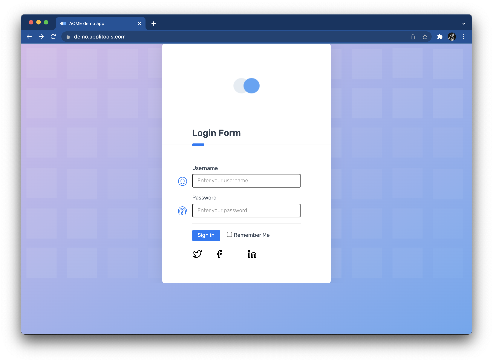
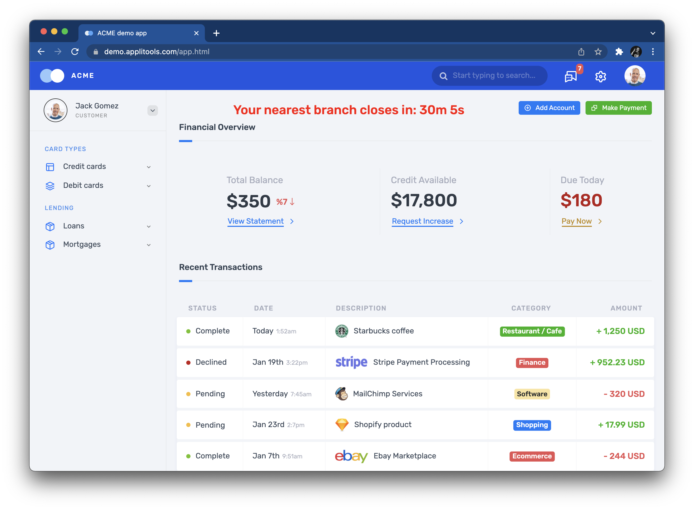
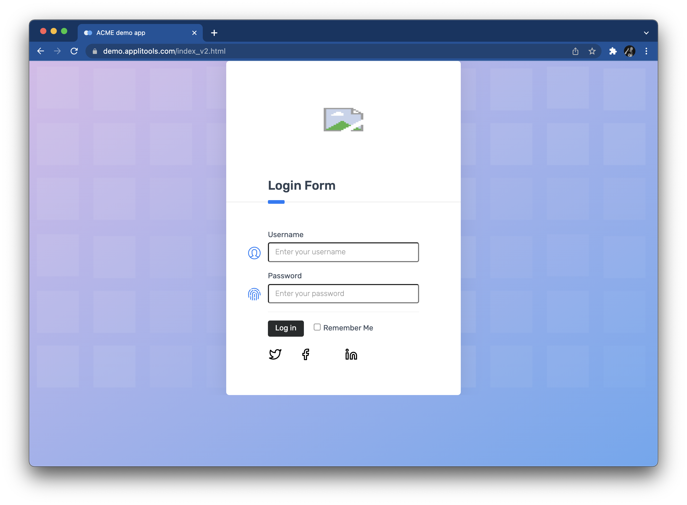
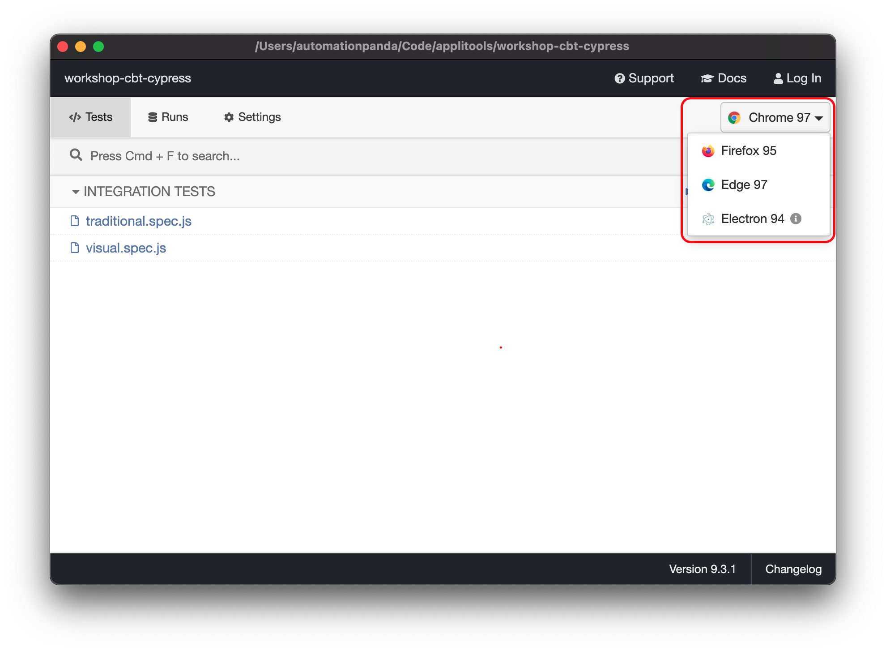
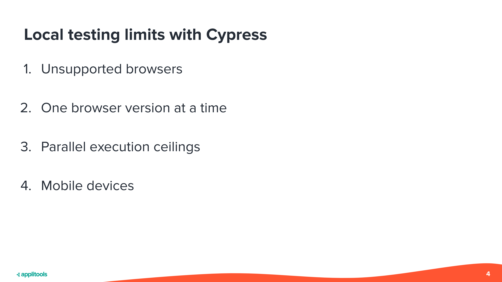
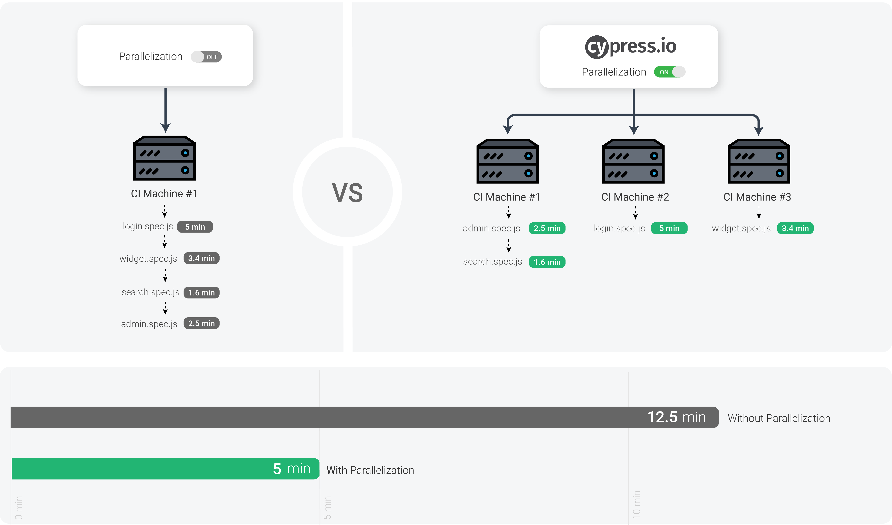
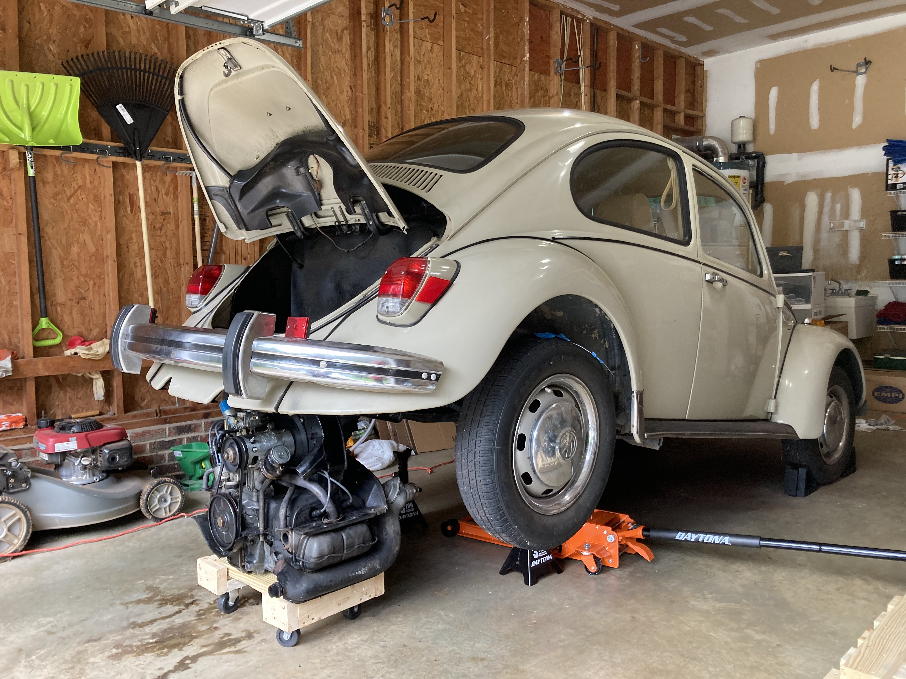
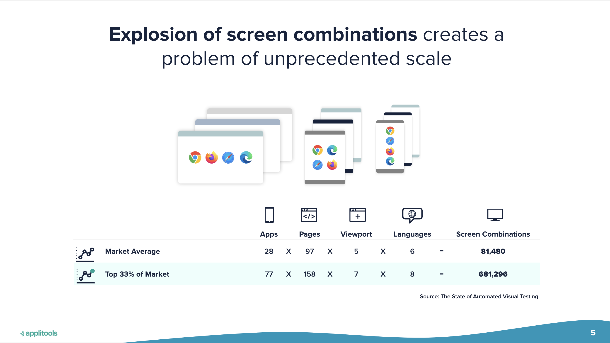
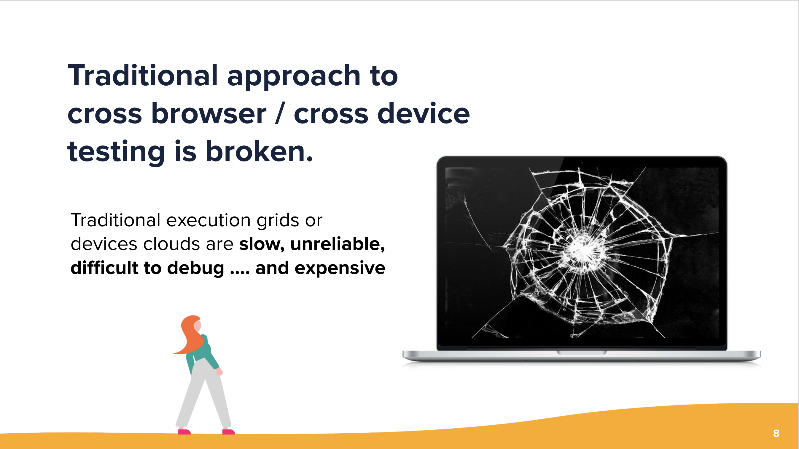

# Workshop Walkthrough

This guide provides a full written walkthrough for the
[Modern Cross-Browser Testing with Cypress](http://applitools.info/66v) workshop
led by [Pandy Knight](https://twitter.com/AutomationPanda)
and hosted by [Applitools](https://applitools.com/).
You can code along with the video recordings,
or you can reference it afterwards to help you learn more.


## 1. Traditional cross-browser testing

Traditional cross-browser testing requires lots of work,
both in automating test cases and in maintaining testing infrastructure.
Let's give this a try ourselves to see what it takes.


### 1.1. Writing a typical login test

Web UI testing is all about app behaviors:
interacting with visual interfaces and verifying outcomes.
Let's automate a simple website login test to use for cross-browser testing.
We will use the [Applitools demo site](https://demo.applitools.com):
`https://demo.applitools.com`.
This site has a twist, though:
it has a [second version](https://demo.applitools.com/index_v2.html)
with visual differences at `https://demo.applitools.com/index_v2.html`.

The test steps are straightforward:

```gherkin
Scenario: Successful login
  Given the login page is displayed
  When the user enters their username and password
  And the user clicks the login button
  Then the main page is displayed
```

The login page looks like this:



And the main page looks like this:



We can automate this test in many ways,
but for this workshop,
we will build a [Cypress](https://www.cypress.io/) project written in JavaScript.
This repository is structured like a typical Cypress project.
[`cypress/integration/traditional.spec.js`](cypress/integration/traditional.spec.js)
is an automated implementation of this login test:

```javascript
describe('A traditional test', () => {

    beforeEach(() => {
        cy.viewport(1600, 1200)
    })

    it('should log into the demo app', () => {
        loadLoginPage()
        verifyLoginPage()
        performLogin()
        verifyMainPage()
    })
})
```

Cypress uses [Mocha](https://mochajs.org/) as its core test framework.
In Mocha, tests are grouped together in `describe` calls.
The `beforeEach` call sets the browser viewport for Cypress for each test in the group.
Each test is defined using an `it` call.
Here, there is one group ("A traditional test") containing one test ("should log into the demo app").
Each step in the login test is implemented as a helper method.

Loading the login page looks like this:

```javascript
function loadLoginPage() {
    let site = Cypress.env('DEMO_SITE') ?? 'original'
    let extra = (site == 'original') ? '' : '/index_v2.html'
    cy.visit('https://demo.applitools.com' + extra)
}
```

The `loadLoginPage` function uses a Cypress environment variable named `DEMO_SITE`
to specify if the test should run against the original site or the changed site.

Once the login page is loaded, the test verifies that certain things appear:

```javascript
function verifyLoginPage() {
    cy.get('div.logo-w').should('be.visible')
    cy.get('#username').should('be.visible')
    cy.get('#password').should('be.visible')
    cy.get('#log-in').should('be.visible')
    cy.get('input.form-check-input').should('be.visible')
}
```

These assertions explicitly wait for a specific set of elements to appear.
They check purely for appearance – not for any shape, size, or look.

Performing login requires a few WebDriver interactions:

```javascript
function performLogin() {
    cy.get('#username').type('andy')
    cy.get('#password').type('i<3pandas')
    cy.get('#log-in').click()
}
```

Once login is complete, the main page appears.
Unfortunately, there's almost too much on the main page to check!
The test picks a few important things and makes several assertions:

```javascript
function verifyMainPage() {

    // Check various page elements
    cy.get('div.logo-w').should('be.visible')
    cy.get('div.element-search.autosuggest-search-activator > input').should('be.visible')
    cy.get('div.avatar-w img').should('be.visible')
    cy.get('ul.main-menu').should('be.visible')
    cy.contains('Add Account').should('be.visible')
    cy.contains('Make Payment').should('be.visible')
    cy.contains('View Statement').should('be.visible')
    cy.contains('Request Increase').should('be.visible')
    cy.contains('Pay Now').should('be.visible')

    // Check time message
    cy.get('#time').invoke('text').should('match', /Your nearest branch closes in:( \d+[hms])+/)

    // Check menu element names
    cy.get('ul.main-menu li span').should(items => {
        expect(items[0]).to.contain.text('Card types')
        expect(items[1]).to.contain.text('Credit cards')
        expect(items[2]).to.contain.text('Debit cards')
        expect(items[3]).to.contain.text('Lending')
        expect(items[4]).to.contain.text('Loans')
        expect(items[5]).to.contain.text('Mortgages')
    })

    // Check transaction statuses
    const statuses = ['Complete', 'Pending', 'Declined']
    cy.get('span.status-pill + span').each(($span, index) => {
        expect(statuses).to.include($span.text())
    })
}
```

Wow, that's a little overwhelming.
Some assertions just check that elements appear.
Others check aspects of elements, like text values.
Nevertheless, the element locators and the code for performing these assertions are a bit complex.
They also do *not* cover everything on the page.
There's risk that unchecked things could break.


### 1.2. Running the test locally

Let's run this test locally.
To manually launch tests, execute `npx cypress open` from the command line
and then run the target tests from the Cypress browser window that opens.
This repository also has npm scripts for testing declared in `package.json`.
You can run `npm run cypress` to open the Cypress window
or `npm test` to run tests purely from the command line.
The test should take no more than a minute to complete, and it should pass.

Unfortunately, this test overlooks visual things.
Take a look at the "changed" version of the demo site:



Can you spot the subtle differences?

* The icon at the top is broken
* The "Sign in" button now says "Log in"
* This button changed from blue to black

Traditional test automation struggles to detect differences like these.
We could try to add more assertions to our test,
but they'd probably be complicated and fragile.
For now, let's take a risk and ignore them.
(We will revisit ways to handle them better later in this workshop.)

If we want to run this test against either version of the login page,
we could update the `loadLoginPage` method like this:

Try rerunning the test with the changed demo site.
You can execute `npm run cypress:original` and `npm run cypress:changed`
to specify the site version via the `DEMO_SITE` variable.
Even when `DEMO_SITE=changed`, the test will still pass.


### 1.3. Running the test against multiple browsers

Cypress can run tests against Chrome, Edge, and Firefox.
(Unfortunately, other browsers are not supported – at least not yet.)
You can specify the target browser in two ways.

If you run test from the Cypress browser window,
you can select the target browser from the top-right dropdown.
It will show all supported browsers available for testing on your machine:



You can also dictate the target browser with the `--browser <name>` argument.
For example, `npx cypress run --browser chrome` will run tests using Chrome.
`package.json` provides convenient npm scripts for selecting browsers.
For example, `npm run test:chrome` will also run tests against Chrome.

Try running the login test in Chrome, Firefox, and Edge.
It should pass in all browsers.

Note that the target browser is *not* coded into the test case itself.
Tests should be able to run against any browser,
and each test launch should pick one target browser.
If you want to run on multiple browsers,
then trigger the tests separately for each browser.


### 1.4. Scaling out cross-browser testing yourself

Local testing is fine while developing automated tests,
but it's not good practice for running tests "for real."
Local machines have limits:



* Cypres does not support *all* browser types.
  Namely, it does not support Safari or Internet Explorer.
* One machine can have only one version of a browser at a time,
  unless you make some questionable hacks.
* One machine can run only a limited number of tests in parallel.
  Optimal execution time is typically 1 web test per processor/core.
* Laptops are not mobile devices.
  Either you emulate mobile devices or connect remotely to physical devices.
  Cypress also has limitations on its mobile testing capabilities.

Ideally, web UI tests should be run from a Continuous Integration system
with scaled-out infrastructure to handle cross-browser testing.

One way to do this is to build the infrastructure yourself.
Cypress provides guides on 
[parallelization](https://docs.cypress.io/guides/guides/parallelization)
and [cross-browser testing](https://docs.cypress.io/guides/guides/cross-browser-testing).
Essentially, you will need to create a Cypress dashboard and set up a cluster of machines to handle testing.
It's similar to [Selenium Grid](https://www.selenium.dev/documentation/grid/) for Selenium WebDriver.



I used Selenium Grid when I worked at [Q2](https://www.q2.com/).
You can read all about it in a case study I wrote in collaboration with [Tricentis](https://www.tricentis.com/):
[How Q2 uses BDD with SpecFlow for testing PrecisionLender](https://automationpanda.com/2021/09/21/how-q2-uses-bdd-with-specflow-for-testing-precisionlender/).
Basically, we created multiple Selenium Grid instances using Windows virtual machines in Microsoft Azure.
When tests launched, TeamCity (our CI system) ran PowerShell scripts to power on the VMs.
The grid would take a few minutes to boot.
Then, once tests completed, TeamCity ran PowerShell scripts to power off the VMs to save money.
Since we tightly controlled the grids, tests ran just as fast as they did on our local laptops.
We could scale up to 100 parallel tests.



Unfortunately, do-it-yourself infrastructure, whether with Cypress or Selenium, is a hassle.
It's like maintaining an old car: there are always problems.
Figuring out correct setup, security policies, and performance tuning took our team *months*.
It truly was never a finished project because we kept needing to make adjustments as our suites grew.
We also had to set up and configure everything manually.
Any time a browser update came along, we needed to log into every VM and make updates.

On top of perpetual maintenance, our grids would arbitrarily crash from time to time.
Hubs would go unresponsive.
Browser sessions on nodes would freeze.
Debugging these issues was practically impossible, too.
Usually, all we could do was just relaunch test suites.



True cross-browser testing has a combinatorial explosion of screens to cover.
Think about every browser, OS, platform, and version.
Then, think about every page, viewport, and even language.
That's enormous!
Building your own grid, you can accommodate some of these, but not all.


### 1.5. Scaling out cross-browser testing as a service

Instead of building your own infrastructure,
you can pay an external vendor to provide it for you as a cloud-based service.
A vendor handles all the screen combinations for you.
Your test simply needs to declare what you want for your remote Cypress session.
Vendor platforms also typically have nice features like dashboards, screenshots, and videos.



Unfortunately, traditional cross-browser-testing-as-a-service still has problems.
Difficulties with security, debuggability, and reliability are the same as for DIY grids.
Tests also run much slower because they need to communicate with a more distant session.
Anecdotally, my tests have taken 2-4x more time to complete versus running locally or in my own grid.
That's *huge*.
Furthermore, cross-browser vendor services can be quite expensive,
and they set ceilings on your level of scale with your service plans.


## 2. Modern cross-browser testing

TBD


### 2.1. Reconsidering what should be tested

TBD


### 2.2. Introducing Applitools Ultrafast Grid

TBD


### 2.3. Rewriting login as a visual test

TBD


### 2.4. Running visual tests across multiple browsers

TBD


### 2.5. Integrating modern cross-browser testing with CI/CD

TBD
